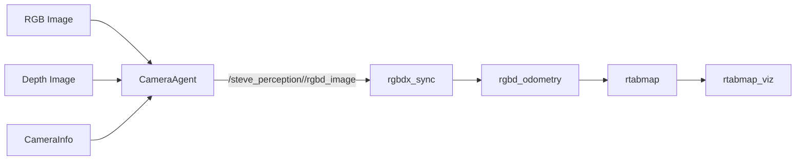

# steve_perception

`steve_perception` is a ROS 2 package that standardizes **RGB-D inputs** for SLAM.

It provides:
- **CameraAgent** nodes that time-synchronize `Image` + `Depth` + `CameraInfo` and publish `rtabmap_msgs/RGBDImage`.
- Launch files for:
  - **Perception only** (publishes `/steve_perception/<camera>/rgbd_image`).
  - **Mapping** with RTAB-Map (`rgbdx_sync` → `rgbd_odometry` → `rtabmap` + `rtabmap_viz`).



## Prerequisites

- Ubuntu + ROS 2 (tested with **Humble**)
- `rtabmap_ros` installed (binary is fine for single camera)

Install common dependencies:

```bash
sudo apt update
sudo apt install -y \
  ros-humble-rtabmap-ros \
  ros-humble-rtabmap-msgs \
  ros-humble-tf2-ros \
  ros-humble-tf-transformations \
  ros-humble-message-filters \
  ros-humble-cv-bridge
```

### Multi-camera note

If you plan to use **multiple RGB-D cameras** with RTAB-Map’s multi-camera sync (`rgbdx_sync`), you typically need an RTAB-Map build that enables multi-RGBD sync support (commonly built with `-DRTABMAP_SYNC_MULTI_RGBD=ON`).

For the current repository baseline, **single camera mapping is the recommended starting point**.

## Build

Add the package to a ROS 2 workspace and build with `colcon`:

```bash
mkdir -p ~/ros2_ws/src
cd ~/ros2_ws/src
# put this repository/package here

cd ~/ros2_ws
rosdep install --from-paths src -i -y
colcon build --symlink-install
source install/setup.bash
```

## Run

### 1) Perception only (publish RGBDImage)

```bash
ros2 launch steve_perception perception.launch.py
```

This is useful when you only want synchronized `RGBDImage` topics and you will launch SLAM/mapping separately.

### 2) Mapping (RTAB-Map)

```bash
ros2 launch steve_perception mapping.launch.py
```

This launch starts:
- `perception_node`
- RTAB-Map sync/odometry/mapping (`rgbdx_sync`, `rgbd_odometry`, `rtabmap`, `rtabmap_viz`)

## Configuration

- `config/steve.yaml`
  - Defines cameras and their raw topic names
  - Controls which cameras are allowed to publish `RGBDImage`

- `config/mapping.yaml`
  - Mapping profile (frames, `use_sim_time`, and which RGBD topics to use)

- `config/rtabmap_*.ini`
  - RTAB-Map algorithm parameters

## Quick checks

```bash
# Is RGBDImage being published?
ros2 topic hz /steve_perception/front/rgbd_image

# Do all nodes use simulation time (Gazebo)?
ros2 param get /rtabmap use_sim_time

# TF sanity (should not spam extrapolation errors)
ros2 run tf2_tools view_frames
```

## Common failures (and what they actually mean)

- **RTAB-Map: "Did not receive data since 5 seconds"**
  - One of the synced inputs paused, has no header stamp, or timestamps drift too far.
  - Check rates:
    - `ros2 topic hz /steve_perception/front/rgbd_image`
    - (and the underlying raw RGB/depth topics)
  - If rates are noisy, increase `topic_queue_size` / `sync_queue_size` in the launch.

- **TF: "Lookup would require extrapolation into the future"**
  - The sensor message timestamp is *ahead* of the newest TF available.
  - Usual causes:
    - `use_sim_time` mismatch between nodes
    - TF published with the wrong clock (sim vs wall)
    - TF published too slowly for your sensor timestamps
  - Mitigations:
    - Make `use_sim_time` consistent across the stack.
    - Increase `wait_for_transform` and/or `tf_delay` slightly (RTAB-Map params).

- **Multi-camera PnP registration error (OpenGV)**
  - If you see:
    - `Multi-camera 2D-3D PnP registration is only available if rtabmap is built with OpenGV`
  - Options:
    - Run **single camera** mapping.
    - Build RTAB-Map from source with **OpenGV**.
    - Switch the multi-camera registration method to a **3D-3D** approach (ICP-based) instead of PnP.

## Roadmap

- Clean multi-camera mapping profile (front + pan/tilt) with a documented registration choice.
- Optional 2D lidar input for improved odometry in long corridors.
- Small demo world / recorded rosbags for regression tests.

## Suggested docs assets

These are small but useful additions:
- `docs/images/rqt_graph.png` (graph of `mapping.launch.py`)
- `docs/images/rtabmap_viz.png` (example of a good map)
- `docs/images/tf_tree.png` (from `view_frames`)
